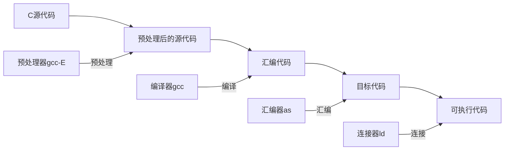

# 第一章 操作系统概述

## 1. 认识操作系统

### 1.1 概述

> 计算机系统由硬件和软件两部分组成。硬件是组成一台计算机的各个部件，包括**中央处理器(CPU)**、**内存**和**设备**。软件包括系统软件和应用软件。
>
> <u>*操作系统是计算机系统中最基本的软件。*</u>它直接管理和控制计算机的资源，合理地调度资源，使之得到充分的利用，并为用户使用这些资源提供一个方便的操作界面和良好的用户界面。
>
> 操作系统作为计算机系统的资源管理器，它的功能是管理和控制系统资源，它的功能可以归为五类，包括*<u>处理器管理</u>*、*<u>存储器管理</u>*、*<u>设备管理</u>*、*<u>文件管理</u>*和*<u>用户接口</u>*。

<svg width=100% height=200>   
    <rect x="10%" y="85%" height="15%" width="80%" fill="transparent" stroke="black" stroke-width="2"/> 
    <text x="44%" y="95%" fill="black" >计算机硬件</text>
    <rect x="15%" y="70%" height="15%" width="70%" fill="transparent" stroke="black" stroke-width="2"/> 
    <text x="45%" y="80%" fill="red" >操作系统</text>    
    <rect x="20%" y="55%" height="15%" width="60%" fill="transparent" stroke="black" stroke-width="2"/> 
    <text x="45%" y="65%" fill="black" >系统软件</text>    
    <rect x="25%" y="40%" height="15%" width="50%" fill="transparent" stroke="black" stroke-width="2"/> 
    <text x="45%" y="50%" fill="black" >应用软件</text>
    <line x1="15%" y1="30%" x2="25%" y2="47.5%" stroke="black"  stroke-width="2"/>
    <line x1="15%" y1="30%" x2="20%" y2="62.5%" stroke="black"  stroke-width="2"/>
    <text x="10%" y="30%" fill="black" >用户</text>
    <text x="38%" y="10%" fill="black" >操作系统地位示意图</text>
</svg>


### 1.2 分类

#### 按处理方式

> **多道批处理操作系统**(Batch Processing OS)：多道是指在内存中存在多个作业，同时处于运行状态，共享系统资源。批处理是指在系统外存中存在大量的后备作业，随时可调入内存，同时作业不受用户控制，批处理系统有时又称为脱机系统。常用于各种大型系统。
>
> **分时操作系统**(Time Sharing OS)：分时操作系统由多个用户使用各自独立的终端共享一台计算机。系统把CPU的运行时间分为很短的时间片，按时间片轮转法将CPU轮流分配给各个作业用户使用。分时操作系统具有强大的交互通讯能力，代表是UNIX系统。
>
> **实时操作系统**(Real Time OS)：实时操作系统是指具有一定实时资源调度以及通信能力的操作系统。“实时性”是指对特定事件的响应和处理时间是可预知的，在任何情况下都不会超过系统所承诺的上限。

#### 按规模和用途分类

>  **主机操作系统**(Mainframe OS)：是指运行在IBM公司的大型机以及其他厂商制造的兼容主机上的操作系统。大型机与其他计算机的主要区别是其强大的IO能力以及极高的可靠性，大型机的IO吞吐量可达美妙万兆字节以上，而系统的可用性可达100%，一次其操作以批处理作业为主，主要在金融、政府和大型企业等的高端数据中心中。
>
> **通用操作系统**(General Purpose OS)：最常用的操作系统，它是由分时操作系统发展而来，是分时系统和批处理系统的结合。其原则是分时优先，批处理在后，这类计算机可以运行在各种标准化体系架构中，由于这类计算机都是以服务器方式运行，所以这类操作系统又称为服务器操作系统，常用UNIX、Linux和windows。
>
> **个人操作系统**(Personal OS)：为个人应用而设计的操作系统，通常是单用户多任务系统。与其他操作系统相比，个人操作系统更注重系统的易用性，而不是系统的利用率，因此，它们的交互界面都非常美观且便于操作，强调对多媒体和网络访问功能的支持，以满足用户日常办公、学习和娱乐方面的要求。个人操作系统根据运行平台主要分为桌面操作系统、平板操作系统和手机操作系统。

#### 按体系结构分类

> **网络操作系统**(Network OS)：指运行在网络服务器上的操作系统，因此又称为服务器操作系统。网络操作系统在内核上支持网络设备驱动和网络协议，具备较强的网络通信能力，同时提供包括文件传输、远程登陆、数据库访问、电子邮件、信息检索等服务，使网络用户能够方便地利用网络上的各种资源。由于运行在开放的网络环境中，开放性、并发性、安全性和可靠性都是网络操作系统的重要指标。
>
> **分布式操作系统**(Distributed OS)：分布式系统由若干台计算机组成，它们通过高速局域网连接，形成一个紧密耦合的集群，在同意太操作系统的控制下运行，这个操作系统就是分布式操作系统。分布式操作系统负责管理分布式系统各个节点的资源，并控制分布式程序的运行。在分布式操作系统的控制下各个节点机协调工作，并行计算，相互可以充分利用共享资源，从而获得极高的整体运算能力。同时，分布式系统的另一优势是其可靠性，不会因一个节点机的失效而导致系统失效。
>
> **嵌入式操作系统**(Embeded OS)：运行在嵌入式系统环境中，对整个嵌入式系统资源进行调度和控制的系统。与其他系统相比，嵌入式系统具有一下特点：
>
> 1. 体积小
> 2. 可靠性高
> 3. 实时性强
> 4. 智能化

## 2. Linux系统

### 2.1 发展历史

> UNIX
>
> Minix
>
> **GNU计划(自由软件运动GNU's Not Unix)、GPL(General Public License通用软件许可)**

### 2.2 特点

> Linux是一个<u>*遵循POSIX标准的*</u>，<u>*多用户*</u>、<u>*多任务*</u>的自由操作系统。与其他系统相比，它具有以下显著的特点：
>
> 1. 基于UNIX设计，性能出色。
> 2. 遵循GPL许可，自由软件。
> 3. 符合POSIX标准，兼容性好。POSIX是由IEEE制定的标准族，POSIX是指可移植操作系统接口，全称Portable Operating System Interface。
> 4. 可移植性好。
> 5. 网络功能强大。
> 6. 安全性好。
>
> 它的基本思想包括两点：
>
> 1. **一切皆文件。**即系统中的所有内容都归结为一个文件，包括命令、硬件和软件设备等；
> 2. 每个软件都有确切的用途。对于操作系统内核而言，都被视为拥有各自特性或者类型的文件。

### 2.3 组成结构

> Linux的内核主要由三个部分组成，包括<u>*内核*</u>、<u>*Shell*</u>和<u>*文件系统*</u>。
>
> 内核负责运行程序和管理基本硬件设备的核心程序；Shell是系统的命令行用户界面，负责接受、解释和执行用户输入的命令；文件系统是按一定的组织结构存放在计算机磁盘上的文件集合。

<svg width=100% height=200>   
    <rect x="40%" y="85%" height="15%" width="20%" fill="transparent" stroke="black" stroke-width="2"/> 
    <text x="47%" y="95%" fill="black" >硬件</text>
   	<line x1="50%" y1="85%" x2="50%" y2="75%" stroke="black"  stroke-width="2"/>
    <rect x="30%" y="60%" height="15%" width="40%" fill="transparent" stroke="black" stroke-width="2"/> 
	<text x="47%" y="70%" fill="black" >内核</text>
    <rect x="30%" y="45%" height="15%" width="40%" fill="transparent" stroke="black" stroke-width="2"/> 
	<text x="35%" y="55%" fill="black" >系统程序/应用程序</text>
    <rect x="30%" y="30%" height="15%" width="20%" fill="transparent" stroke="black" stroke-width="2"/> 
	<text x="36%" y="40%" fill="black" >Shell</text>
    <rect x="50%" y="30%" height="15%" width="20%" fill="transparent" stroke="black" stroke-width="2"/> 
	<text x="52%" y="40%" fill="black" >X图形界面</text>
    <line x1="50%" y1="24%" x2="55%" y2="30%" stroke="black"  stroke-width="2"/>
	<line x1="50%" y1="24%" x2="45%" y2="30%" stroke="black"  stroke-width="2"/>
	<text x="48%" y="22%" fill="black" >用户</text>
	<text x="36%" y="10%" fill="black" >Linux系统基本结构示意图	</text>
</svg>


### 2.4 Linux版本

> **内核版**：由内核团队维护和发布的内核的版本；
>
> **系统版**：以Linux内核为基础构造的、由各发行商或社团组织维护和发布的完整的操作系统版本，也称发行版。

#### 常用的发行版

> Red Hat、CentOS
>
> Debian、Ubuntu、Mint
>
> SUSE
>
> Slackware


# 第二章 Linux操作基础

## 1. 基本操作

### 1.1 终端

> **终端**是指用户用来与系统交互的设备，每个用户都需要通过终端来使用系统。终端根据<u>显示模式的不同</u>，分为<u>*字符终端*</u>和<u>*图形终端*</u>。字符终端负责接受键盘输入的命令，图形终端可以显示图形界面并支持鼠标操作。根据<u>连接方式的不同</u>又可以分为<u>*本地终端*</u>和<u>*远程终端*</u>，本地终端直接与系统相连，又称为控制台，远程终端是用户通过网络或其他通信方式远程控制系统时使用的终端。根据<u>实现方式的不同</u>又可以分为<u>*物理终端*</u>、<u>*虚拟终端*</u>和<u>*伪终端*</u>。物理终端是实际存在的终端设备（Linux存在唯一物理终端root终端）；虚拟终端是在物理终端上模拟出的逻辑上的终端，目的是将一个物理终端转化为多个可用的终端（Linux系统将其划分为最多12个虚拟终端，对应F1-F12）；伪终端是软件仿真除开的终端，它不对应任何终端设备，只是一个运行在图形界面中的仿真字符终端界面的应用窗口（终端模拟器）。
>
> 终端的命名规则，控制台的终端名为`ttyn`，其中n为控制台的逻辑编号，图形控制台为`:n`，其中n为0时表示默认启动的图形控制台，运行的是桌面；伪终端按照启动的顺序命名，其终端名为`pts/n`。

### 1.2 登录方式

> Linux系统的登录方式分为<u>*控制台登录*</u>和<u>*远程登录*</u>。

#### 控制台登录

> 系统启动后，会在每个启动了的控制台上显示登录界面。Linux允许同一用户在不同的控制台上以相同的身份或者不同的身份多次登录，同时进行几项作业，各个控制台上的交互过程是相互独立的。

#### 远程登录

> 远程用户可以通过远程终端登录到Linux系统上。远程登录的用户可以在自己所在的终端上像本地用户一样与系统交互、发布命令并得到显示结果。允许远程登录标志着Linux是一个真正意义上的多用户操作系统。系统可以为多个远程的和本地的用户服务，对登录用户数也没有限制。

### 1.3 Linux命令

> Linux系统为用户提供了一套完整的命令，使用这些命令可以有效地完成各种工作，Linux的命令由Shell程序解释执行，所以也常常称其为Shell命令。在使用Linux命令前首先要启动Shell程序，Shell程序的启动伴随着字符终端启动或图形界面上的终端工具启动而启动。
>
> Shell启动完毕后，对于普通用户，其默认的输入提示符为`$`，对于超级用户，其默认的输入提示符为`#`。

Shell命令的基本格式如下：

```Shell
$ command options params
```

一些常见的命令如下：

| 按键     | 功能                   |
| -------- | ---------------------- |
| Ctrl+u/k | 删除光标之前/后的内容  |
| \        | 续行符，用于长文本输入 |
| Tab      | 补全命令               |
| Ctrl+c/z | 结束当前命令的允许     |
| Ctrl+s   | 暂停屏幕输出           |

> 具体操作命令见`Linux.md`文件。


## 2. Linux文件操作

> 文件系统是Linux系统的基本组成部分。Linux系统运行所依赖的各种程序和数据都以文件形式存储在磁盘上的文件系统中。
>
> 文件系统统一存储和管理所有的文件，用文件名来标识各个文件。用户通过文件名来访问和使用文件系统中的文件。文件系统中的所有文件通过目录的形式组织和存放。目录是一种特殊的温暖就，其内容是该目录下的一组文件的信息。目录将所有的文件分层分支地组织在一起，形成文件系统的树形结构。

### 2.1 文件命名

> Linux文件名的最大长度是255个字符，通常由字母、数字、`.`、`_` 、`-`字符组成。以`.`字符开头的文件是隐藏文件，在通常情况是不显示的，其他特殊字符在内核中具有特殊意义，因此不能用于文件名，同时值得注意的是，**在Windows文件系统中，文件名不区分大小写，但在Linux中，文件名严格区分大小写。**

### 2.2 文件名通配符

#### 模式

> 当一个命令需要对多个文件进行操作时，逐个写出文件名是件很麻烦的事情，这是可以使用模式来简化对文件名的描述。
>
> *模式是对一类事物概括性的描述。*当需要指定具有某种特征的多个文件名是，可以用一个表示文件名的字符串模式来描述。字符串模式由普通字符和一些具有特殊含义的字符组成，这些特殊字符被称为通配符，通配符不代表某个具体的字符。

#### 通配符

> 基本的通配符包括`?`、`*`、`[]`等等，`?`表示任意的一个字符，`*`表示任意多个字符（不包括`.`），`[]`表示匹配括号中的字符集合中的如何单个字符，其中，字符集合的表示方法包括列举（如：[a,b]）、范围（如：[a-z]）和排除（如：[!0-9]）。

#### 模式置换

> 当命令的参数出现通配符时，Shell并不是直接将该参数传递给命令，而是将其看作文件名模式字符串，与现有文件名进行逐个匹配比较返回，最后再执行相应的命令。

### 2.3 文件类型

> 常见意义上的文件是那些用于保存数据的文件，此外，Linux系统还定义了一些特殊类型的文件，它们在系统中有特殊的意义。
>
> + 普通文件(`-\.`)：普通文件是普通意义上的文件，用于保存数据；
> + 目录文件(`d`)：目录是一种特殊文件，用于构成文件系统的树形结构；
> + 设备文件(`c、b`)：Linux系统将设备看作特殊的文件，分为字符设备(c)和块设备文件(b)。
> + 符号链接(`l`)：符号链接文件是一种特殊文件，它的内容是到另一个文件的链接，用于实现文件的共享。
> + 管道文件(`p`)：管道文件是一种特殊文件，用于实现进程间传递数据。

### 2.4 文件归属关系

> Linux是一个多用户系统，每个用户都要在系统中存放自己的文件。为了管理的需要，系统要能够区分文件的归属关系。Linux系统中的每个文件都有两个描述其归属关系的属性，这就是<u>*属主(owner)*</u>和<u>*属组(group owner)*</u>。
>
> 文件的属主就是文件的所有者，文件的属组就是该文件所归属的用户组，通常是属主所在的用户组，用组名标识。

### 2.5 文件的访问权限

#### 概述

> 在多用户的系统中，文件的保密和安全性至关重要。为防止文件被非法地使用和破坏，系统使用权限来限制用户对文件的访问。
>
> 文件访问权限通常包括<u>*读(r)、写(w)、执行(x)*</u>权限，当一个文件执行一个未被授权的操作时，系统会拒绝执行并显示信息`Permission denied`。
>
> Linux采用分类授权的权限分配方式实现不同类型用户赋予不同权限，Linux系统将每个文件的用户分为三类，在设置文件访问权限时可有针对性设置。注意root用户不受访问权限的限制。

| 权限范围 | 针对用户           | 字符标识 |
| -------- | ------------------ | -------- |
| 属主     | 文件的拥有者       | u(ser)   |
| 组用户   | 文件的属组中的用户 | g(roup)  |
| 其他人   | 除以上其他用户     | o(ther)  |
| 所有人   | 以上3类用户总和    | a(ll)    |

> 通常情况下3类权限即可满足使用需求，对于权限划分需求更大的情况，可以通过更为强大的文件访问控制机制，即访问控制列表（Access Control List, ACL）来实现。ACL出来可以设置上述3类外，还可以针对个别用户或用户组设置权限，具体用法可参考联机手册(`man acl`)。

#### 表示方法

> 文件的类型和权限通常采用**字符法**表示，即用10个字符的字符串来表示文件的类型和权限，第一个字符表示为文件类型，后9个字符按3个一组对应u、g和o的权限。如：drwxr-x---表示这是一个目录文件，u对其拥有所有权，g对其拥有读、执行权，其他用户不具有任何权限。
>
> 此外还有一种数字表示法。规则是用数字1或0来表示权限字符，有相应权限为1，无则为0，形成一个9位长的二进制数，用3位八进制数来表示。如：drwxr-x---用数字表示法即为750。

#### 作用

> 设置访问权限是为了限制对文件的访问操作，正确地设置文件权限可以允许正常的访问操作，同时阻止不预期的访问。

| 访问权限 | 字符表示 | 对文件访问限制 | 对目录访问限制                       |
| -------- | -------- | -------------- | ------------------------------------ |
| 读权限   | r        | 可读取其内容   | 可列出其中的文件列表                 |
| 写权限   | w        | 可修改其内容   | 可在其中创建、删除文件，或修改文件名 |
| 执行权限 | x        | 可执行其内容   | 可进入该目录并访问该目录下的文件     |

#### 默认权限

> 新建文件或目录时，系统会为其设置最初的权限。文件的初始权限由文件创建掩码决定(creation mask)决定。掩码是一个9位二进制数字，通常用八进制数字表示，其位与权限字符串相对应，掩码中位为1即为限制对应权限。
>
> 1. *<u>可执行文件</u>*：通过编译程序执行生成的可执行文件，它的默认权限是777-掩码；
> 2. *<u>非可执行文件</u>*：对于非可执行文件，在创建时默认是没有x权限的，对于这类文件的x权限需要显示地赋予，此时新建文件的权限是（777-掩码）&666。
> 3. *<u>目录</u>*：同可执行文件，新建目录的默认权限是777-掩码。
>
> 用户登录时，系统自动地为其设置了掩码，通常是022。用户可以通过命令修改掩码，从而改变新建文件的默认权限，使之具有合适的安全性。


## 3. Linux目录操作

> 计算机系统中存有大量的文件，为了有效地组织和管理这些文件，系统将文件分门别类地纳入目录中保存。

### 3.1 目录结构

#### 根目录

> Linux的文件系统采用了树型目录结构。文件系统中的根目录成为root目录，是一个特殊的目录，用`\`表示，是目录树型结构的唯一根节点，其下文件则为其子节点。

#### 当前目录

> 用户在系统中工作时，始终处在某个目录之中，此目录称作当前目录。用户可以通过改变当前目录来变换其在文件系统中的位置。当前目录用`.`表示，其父目录用`..`表示，每个目录都至少有`.`，`..`这两个隐含文件，但根目录中的两者都是值其自身。

#### 路径

> 在指定一个文件时，除文件名外，还须指明文件在目录树中所处在位置。**路径是关于一个文件的名称及位置的完整描述，用路径名来表达。**系统中的每个文件（包括目录）都可以用了路径名来唯一地指定。路径名由若干个文件名连结起来。中间用斜杠`/`分开。路径名的前面部分用来定位该文件所要经历的目录的文件名（也就是目录名），最后是文件自身的文件名。
>
> 根据起点的不同，路径分为绝对路径和相对路径两种。绝对路径是从根目录开始眼目录树到达文件节点的路径。绝对路径名都是以`/`开头，并且都是唯一的。相对路径是从当前目录沿目录树到达文件节点的路径。相对路径名与当前目录所处的位置通常以`./`开头，也可以省略此前缀。

#### 用户主目录

> 用户刚登录到系统时的所处的目录称为主目录，系统默认的用户主目录是`/home/username`，其中username是用户的名字，用`~`表示，在主目录下的文件，用户具有全部权限，可以任意组织自己的文件。注意以`~`开头的是绝对路径，因为它与当前目录无关，同时在路径操作中，会被替换为`/home/username`。

### 3.2 目录/文件操作

> Linux提供了一些专门针对目录或文件进行操作的命令，如新建、删除或重命名等操作，此处不多赘述，详情查看Linux命令文档。

| 功能分类             | 命令            |
| -------------------- | --------------- |
| 文件显示             | cat、more、less |
| 文件复制、删除和移动 | cp、rm、mv      |
| 文件内容的统计和排序 | we、sort        |
| 修改文件权限         | chmod           |
| 修改文件时间标签     | touch           |
| 设置文件掩码         | umask           |
| 文件查找、搜索       | find、grep      |

### 3.3 输入/输出重定向

#### 输入与输出

> Shell命令或应用程序在执行时，往往需要从输入设备接受一些输入数据，并将处理结果显示到输出设备上。在Linux系统中，这些输入输出设备都当作文件对待。对应的输入输出设备文件称为I/O文件，Linux系统中定义了3个标准的I/O文件，即标准输入文件stdin、标准输出文件stdout和标准错误输出文件stderr。在默认情况下，stdin对应终端的键盘，stdout对应终端的屏幕，stderr也对应终端的屏幕。
>
> 典型的命令和应用程序都设计为使用标准I/O设备进行输入输出，它们从stdin接受输入数据，将正常的输出数据写入到stdout，将错误信息写入到stderr。在命令开始运行时，Shell会自动为它打开这3个标准I/O文件，并建立起文件和终端设备的连接。这样，当命令运行时就会自动完成完整的命令输入输出流。
>
> 注意的是，标准I/O文件与实际设备之间的关联关系是命令在运行之际由Shell为其建立的，命令本身并不知道这种关联关系，同时，这种关系可以通过输入输出重定向来改变。
>
> 利用输入输出重定向以及基于输入输出重定向实现的管道机制，用户可以灵活地改变Linux命令的输入输出走向，或将多个命令的输入输出相衔接，实现灵活多变的功能。


#### 输入重定向

> 输入重定向是指把命令的标准输入改变为指定文件（包括设备文件），使命令从该文件中而不是从键盘中获取输入。输入重定向主要用于改变那些大量标准的命令的输入源。
>
> 当提交一个输入重定向命令时，Shell会首先断开键盘与命令的stdin关联，将指定文件关联到stdin,然后运行命令。这样该命令就会从这个文件中读取标准输入信息。

```bash
$ command < file
```

#### 输出重定向

> 输出重定向是指命令的标准输出或标准错误输出到重新定向到指定文件中。这样，该命令的输出就不会显示在屏幕上，而是写入到文件中。
>
> 输出重定向包括以下几种形式：
>
> 1. *标准输出重定向*：将命令的标准输出保存到一个文件中。
> 2. *标准错误输出重定向*：将命令的标准错误输出到一个文件中。
> 3. *合并输出重定向*：将命令的标准输出和标准错误输出到同一个文件中。
> 4. *附加输出重定向*：将命令的附加输出附加在一个文件的后面。

```bash
$ command > file	# 标准输出重定向
$ command 2> file	# 标准错误输出重定向
$ command &> file	# 合并输出重定向
$ command >> file	# 附加输出重定向
```

#### 管道

> 管道(pipe)的功能是将一个程序或命令的输出作为另一个程序或命令的输出。利用管道可以将一系列命令连接起来，形成一个管道线，从而将多个命令像流水线一样加工命令，从而提高操作能力和效率。

```bash
$ command1 | command2
```


# 第三章 vi文本编辑器

## 1. 概述

> 与UNIX一样，Linux本质上也是一个文本驱动的操作系统。文本文件就是全部由ASC码字符及某种语言的编码字符组成的文件，不含有任何样式和格式信息，文本文件可以被任何文本编辑器解释，也可以被所有程序操作和使用。在Linux系统中文本文件被光粉底用作系统配置文件和系统工具软件的操作对象。

### 1.1 vi文本编辑器简介

> Linux下的文本编辑器有很多，vi编辑器是其中最基本的文本编辑器。vi(sual)诞生于1978年，由柏克莱大学的Bill Joy编写。从其诞生至今，vi始终是所有UNIX/Linux系统上必备的编辑器。目前Linux系统上最流行的vi版本是vim。它是vi的增强版，它在功能上有很多扩充，关键的是，它是一个开源软件。相比于其他编辑器，vi编辑器具有以下特点：
>
> 1. 编辑功能强大；
> 2. 适用于各种版本的UNIX/Linux系统；
> 3. 适用于各种类型终端；
> 4. 使用灵活快捷；

### 1.2 vi的工作模式

> vi是一个多模式的软件，它有3种基本工作模式。在不同模式下，它对输入的内容有不同的解释。

#### 命令模式

> 命令模式用于完成各种文本编辑工作。在命令模式下，输入的任何字符都会作为命令来解释执行，而不显示在屏幕上。

#### 输入模式

> 输入模式用于完成文本录入工作。在输入模式下，输入的任何字符都将作为文件的内容被保存，并显示在屏幕上。

#### 末行模式

> 末行模式也称为ex模式。在末行模式下，光标停留在屏幕的最末行，在此处接收输入的命令并执行。末行模式一般用于执行一些全局性操作，如文本操作、参数设置等。

### 1.3 vi的基本工作流程

> 启动vi的方法是在Shell下输入vi命令，命令格式为：

```bash
$ vi filename
```

> vi的启动过程是：先建立一个编辑缓冲区，若指定了文件且该文件已存在，则将其内容读到编辑缓冲区中；若指定的文件不存在，则创建此文件。随后vi显示全屏编辑环境，将光标定位到第一行第一列的位置。启动后屏幕末行显示的是文件的名称、状态、行数和字符数、光标位置等信息。光标位置的字符通常用反显方式或下划线方式显示。用“~”表示编辑器的空行，它们不是文件的组成部分。
>
> vi启动后，首先进入命令模式。此时，用户可以使用vi的编辑命令进行文本的输入和修改。进入输入模式的方法是按<kbd>Insert</kbd>键进入输入模式，输入完毕后按<kbd>Esc</kbd>键退出输入模式，最后要通过末行模式完成文件的保存等，输入`:wq`保存退出，末行模式的命令会显示在屏幕最左下方。


## 2. 基本命令

> vi的命令繁多，具体的教材可以通过输入 `vimtutor` 学习，总的vi命令分为以下几类：
>
> 1. 移动光标命令；
> 2. 插入和删除命令；
> 3. 修改和替换命令；
> 4. 拷贝、粘贴和选择命令；
> 5. 复原和重复命令；
>
> 对于笔者的ArchLinux系统中，采用的是nvim文本编辑器，常用命令可见`nvim.md`文档学习。

### 2.1 光标定位和移动

> 在输入或修改文本前，应将光标移动到合适位置，以下是常用的光标移动命令。其中，在命令前加n即为命令重复n次。

| 命令/定位符 | 功能                                     |
| ----------- | ---------------------------------------- |
| 0、$        | 光标移动到行首、尾                       |
| ^           | 光标移动到行首第一个非空格字符           |
| [n]G        | 光标移动到第n行                          |
| [n]\|       | 光标移动到第n列                          |
| h,j,k,l     | 光标向左、下、上、右移动一个字符         |
| b,w,e       | 光标移动到上一个词、下一个词首、本词词尾 |
| (,)         | 光标移动到句首、句尾                     |
| {,}         | 光标移动到段首、段尾                     |

### 2.2 文本的插入和删除

#### 文本的插入

> 在插入文本前，先将光标定位到要输入的位置，然后执行命令模式，进入插入模式，插入命令包括以下几种：

| 命令 | 功能                                     |
| ---- | ---------------------------------------- |
| a、A | 在光标位置后、行尾后开始插入             |
| i、I | 在光标位置前、行首前开始插入             |
| o、O | 在光标位置所在行之后、之前的新行开始插入 |

#### 文本的删除

> 删除文本最简单的方法是将光标移动到要删除文本所在位置，按一下<kbd>x</kbd>或者<kbd>delete</kbd>键即可删除一个字符，更灵活的删除方法见下。

| 命令     | 功能                                 |
| -------- | ------------------------------------ |
| x、X     | 删除光标处、光标前的字符             |
| dd       | 删除光标所在行                       |
| J        | 删除当前行尾的换行符                 |
| d+定位符 | 删除从光标位置到指定位置范围内的文本 |

### 2.3 文本修改和替换

#### 文本修改

> 文本修改是指改写一部分文本的内容，修改过程是：先删除元文本然后插入，最后结束输入模式。

| 命令     | 功能                           |
| -------- | ------------------------------ |
| cc       | 修改光标所在的行               |
| C        | 修改光标处到行尾的文本         |
| c+定位符 | 修改光标到指定位置范围内的文本 |

#### 文本替换

> 替换是指用一个字符串替换另一个字符串，这是一种覆盖操作，替换后文本长度不变。替代则是用多个字符取代一个字符或一行，是一个先删除后插入的过程。

| 命令 | 功能                                           |
| ---- | ---------------------------------------------- |
| r    | 用输入的字符替换光标处的字符                   |
| R    | 用输入的文本逐个替换光标处开始的字符，直至退出 |
| s    | 用输入的文本替代光标处的字符，直至退出         |
| S    | 用输入的文本替代光标所在行的字符，直至退出     |

### 2.4 文本拷贝、粘贴和选择

> 为实现文本的拷贝粘贴、vi中设置了专门的缓冲区，可称其为剪贴板。拷贝(copy)操作是将指定的文本复制到一个剪贴板中；粘贴(paste)则是将剪贴板中的内容插入到文本当中。此外，前面介绍的删除命令其实是剪切(cut)操作，被删除的文本只是暂存到了剪贴板中，可以粘贴回文本中。
>
> 除此之外，为了方便选取要处理的文本，vim还提供了一种可视化文本选择模式，在此模式下。可以通过移动光标来直观地选取文本，对选择的文本可以进行一定的操作。

| 命令     | 功能                             |
| -------- | -------------------------------- |
| yy       | 拷贝光标所在行                   |
| y+定位符 | 拷贝光标到指定位置范围内的文本   |
| v        | 以字符为单位连续选择文本字符串   |
| V        | 以行为单位连续选择文本行         |
| Ctrl+v   | 按字符位置选择文本块             |
| u        | 撤销上一个命令所做的修改         |
| U        | 最小最近一次对一行所做的全部修改 |
| .        | 重复执行上一次的命令             |


## 3. 基本末行命令

> 在命令模式下，输入“`:`”、“`/`”、“`?`”字符都将进入末行模式，此后的输入都被解释为行命令，在屏幕的末行显示。常用的末行命令分为一下几类：
>
> 1. 字符串搜索和替换命令；
> 2. 文本操作和退出命令；
> 3. 其他命令；

### 3.1 搜索命令

> 要在一个大文件中查找某个字符串时，可以用字符串搜索命令。输入完毕后回车执行，随后按<kbd>n</kbd>或<kbd>N</kbd>移动到下一个匹配字符串字首，如果不存在则会在末行显示“找不到模式”。搜索命令分为以下两种：
>
> 1. `/`模式	从光标处向后搜索，按<kbd>n</kbd>键向后找；
> 2. `?`模式	从光标处向前搜索，按<kbd>N</kbd>键向后找；

### 3.2 替换命令

> 字符串替换使用s命令，它的功能是在指定行中搜索与指定模式相匹配的字符串，用另一个字符串替换它。

```vim
:[n1,n2]s/p1/p2/[g][c]
```

> 其中`n1`、`n2`表示目标行的行号范围，可以用`%`代替所有行；未指定范围时，目标行就是光标所在行。`p1`是用做搜索的字符串模式，`p2`是用做替换的字符串模式。模式中可以用`^`代表行首，`$`代表行尾；`g`表示替换目标行中所有匹配的字符串，`c`表示替换前询问用户。

### 3.3 全局命令

> 全局命令的功能是在全文中搜索含有与指定模式相匹配的字符串的行，对匹配的行做标记。

```vim
:g/pl[/command]		对所有包含字符串模式的行执行命令
:g!/pl[/command]	对所有不包含字符串模式的行执行命令
```

### 3.4 全局替换

> s命令是面向行的字符串替换命令。s命令经常与g命令联合使用实现更灵活更细致的全局替换命令，其含义是先用g,i嗯了在文件中搜索含有某个模式的行，并做标记，然后用s命令将所有有标记的行执行搜索和替换。

```vim
gcommand / scommand
```

### 3.4 文件操作

> 文件操作命令包括读文件和写文件操作。读文件就是将文件的内容读入到编辑缓冲区，写文件就是将编辑缓冲区的内容保存到文件中。在退出vi时可以选择是否保存文件，以下是常用的文件操作命令：

| 命令      | 功能                                         |
| --------- | -------------------------------------------- |
| :w [file] | 写入到指定文件，若未指定，默认写入到当前文件 |
| :q        | 未修改原文件，不保存文件，直接退出           |
| :q!       | 放弃原文件的修改，直接退出                   |
| :wq、:x   | 保存文件并退出                               |
| :e!       | 放弃修改，编辑器恢复为文件原样               |
| :e [file] | 打开指定的文件，调入编辑区                   |
| :r file   | 读入指定文件，将文件内容插入到光标位置       |

### 3.5 其他命令

#### 行编辑命令

> 行编辑命令用于对指定行进行编辑。

| 命令         | 功能                                 |
| ------------ | ------------------------------------ |
| :n           | 跳转至第n行                          |
| :n1,n2*co*n3 | 将第n1行至n2行间的内容拷贝到第n3行下 |
| :n1,n2*m*n3  | 将第n1行至n2行间的内容移动到第n3行下 |
| :n1,n2*d*    | 删除第n1行至n2行间的内容             |
| :p           | 显示当前行的内容                     |

#### Shell命令

> 用vi编辑文件时，可以在不退出vi的情况下执行Shell命令，并且在其执行期间vi会处于挂起状态，直至执行结束。

```vim
:!command
```

#### 设置vi选项

> vi是一个高度定制的编辑器，用户可以通过设置vi的选项来规定vi的一些外观和行为特性，使其满足特定的需求。设定vi选项的方法之一是使用set命令。

```vim
:set all	# 查看所有可设置选项
:help		# 查看帮助手册
```


# 第四章 Linux C编程基础

> C语言是Linux系统的标准编程语言，绝大多数Linux系统的系统程序都是用C语言开发的。因此，每一个Linux程序员都需要掌握C编程技能。

## 1. 概述

> 开发一个C应用程序需要经过编辑、编译、测试、运行等多个步骤。在不同的开发环境中，实现这些步骤的方法有所不同。Windows系统的开发环境是集成的，所有开发活动都是在一个单一的应用界面中完成的；而Linux主流开发环境是由一个个独立的工具构成的工具集，每个工具用于完成一项特定的工作，因此需要先了解这些工具及其使用方法。

### 1.1 编辑

> 在Linux系统中，任何一款文本编辑器都可以用来编写程序源代码，其中尤以<u>*vi/vim*</u>和Emacs最为强大。

### 1.2 编译

> 编译器用于将程序源代码转换为目标系统的可执行机器代码。Linux系统上默认的C编译器是gcc。
>
> 对于具有一定规模的软件工程来说，由于源程序数量众多，单独使用gcc生成可执行文件并不方便，此时需要借助工具来辅助构造软件。Linux上默认的工具是<u>*make*</u>。

### 1.3 调试

> 可执行代码中可能存在有执行时错误。查找和修改运行时发生错误的过程称为调试。Linux系统中常用的debug工具是<u>*gdb*</u>。

### 1.4 运行程序

> Linux系统将用户的可执行程序与系统自带的命令一样看待，它们的区别仅在于所处的目录位置可能不同。系统命令对应的可执行文件在系统默认的标准路径下(包括/bin, /usr/bin)，而用户的可执行程序可以在任何位置。Shell在执行一个命令时，需要先查找并加载对应的可执行程序，若命令后中没有指明文件的路径名，则默认地在系统的标准路径下寻找。因此，执行一个系统命令是可以省略路径，而执行用户自己的可执行程序时，如果其不在标准路径下时，需要指明程序的路径名。

### 1.5 帮助手册

> 对编程全过程均有帮助的是系统自带的帮助手册，它可以取代C语言的参考手册，供程序员随时查询。


## 2. gcc编译基础

> gcc是Linux系统上的C编译器。它是一个完全免费的，符合ANSI C/C++标准的多平台编译系统，广泛使用在UNIX/Linux平台编译系统，与其他编译工具相比，gcc的性能表现十分优越，用gcc编译的目标代码具有非常高的运行效率。

### 2.1 gcc编译过程

> 编译器的工作是将源代码翻译成可执行代码。gcc编译的全过程分为4个阶段进行，包括预处理、编译、汇编和连接。



> 以上编译过程可以一次性完成，也可以分阶段进行。程序员可以通过gcc的选项命令来灵活地控制这个过程。

#### 预处理

> 源代码中包含一些预处理语句，如：# include等，<u>*预处理的任务是解析和处理源代码中的预处理语句，执行文件包含、宏替换、条件编译等预处理工作。*</u>预处理的文件可以是多个源代码文件，输出生成一个后缀为"`.i`"的不含预处理的语句的源代码文件。

#### 编译和汇编

> <u>*编译的工作是对预处理后的源代码进行语法和词法分析，生成目标系统的汇编代码文件，后缀名为“`.s`”。*</u>这步工作由gcc完成。<u>*汇编的工作是对汇编代码进行优化，生成目标代码文件，后缀名为“`.o`”。*</u>这步工作由gcc调用汇编器as完成。
>
> 在默认情况下，gcc会按照源代码中的语句直接编译生成目标代码，也就是说，编译后的代码的执行次序和源代码完全相同，没有经过优化处理。这种目标代码易于调试，且编译时间也最短。若要生成更紧凑和更快速的目标代码，则需要在编译时使用代码优化选项。对于大型项目而言，优化可以大幅度提高运行速度，减小代码的尺寸。不过，代码的优化是以牺牲代码的易调试性和编译时间为代价的，所以通常只用于生成最终产品。

#### 连接

> 目标代码是机器语言的代码，但还不是可执行的代码，因为模块化程序通常会有很多个源文件，每一个都对应一些目标文件。另外，程序中还要引用一些库函数，它们的目标代码存放在系统库的目录下。<u>*连接的任务就是解析目标代码中的外部引用，将多个目标文件连接成一个可执行文件。*</u>可执行文件是计算机可直接运行的程序，Linux的可执行文件是不限定类型的，因而无需后缀名。
>
> 连接工作由gcc调用连接器ld完成。连接程序ld在进行连接时，在系统默认的函数库下寻找并加载所需要的库文件。如果要使用放在其他目录下的库文件，则需要在gcc命令行中用选项指示ld目标路径。
>
> C函数库分为*静态库*(`.a`)和*共享库*(`.so`)两种，两者都是C库函数的，o目标代码的集合，在连接时被连入到可执行文件中。两者的区别在于：当程序与静态库连接时，所有程序中用到的库函数的目标代码都被复制到最终的可执行文件中；而当该程序与共享库连接时，可执行文件中只包含程序中用到的函数的引用表，而不是函数的目标代码。这些函数的目标代码只有在有函数调用它们时才被调入内存，并且可以被多个程序共享。因此，连接共享库的可执行文件都比较小，节省磁盘空间和内存空间。由于共享库的优点，在两种版本库都存在的情况下，ld将优先使用共享库进行连接，若要使用静态库，则需要在命令中指定。

### 2.2 gcc命令

> gcc用于实现c程序编译的全过程。文件列表参数指定了gcc的输入文件，选项用于定制gcc的行为。gcc根据选项的规定，将输入文件编译生成适当的输出文件。
>
> gcc的选项非常多，下面仅展示一部分：

```bash
$ gcc [option] files
```

#### 过程控制选项

> 过程控制选项用于控制gcc的编译过程。无过程控制选项时，gcc将默认执行全部编译过程，生成可执行代码。常用的过程控制选项有：

| 选项 | 功能                                   |
| ---- | -------------------------------------- |
| -E   | 预处理，产生预处理后的源代码，不编译   |
| -S   | 预处理+编译，产生汇编代码，不汇编      |
| -c   | 预处理+编译+汇编，产生目标代码，不连接 |

#### 输出选项

> 输出选项用于指定gcc的输出特性等。

| 选项    | 功能                                                   |
| ------- | ------------------------------------------------------ |
| -o name | 指定生成文件的文件名为name                             |
| -Wall   | 显示所有的警告信息而不是只显示默认类型的警告，建议使用 |

#### 头文件选项

| 选项     | 功能                             |
| -------- | -------------------------------- |
| -I目录名 | 将目录加入到头文件搜索命令路径中 |

#### 连接库选项

| 选项     | 功能                           |
| -------- | ------------------------------ |
| -L目录   | 将目录添加到库文件的搜索路径中 |
| -l*name* | 加载名为name的库函数           |
| -static  | 使用静态库                     |

#### 代码优化选项

> gcc提供了几种不同级别的代码优化方案，分别是0、1、2、3和s级，使用-Olevel选项表示。其中默认是0级，即不进行优化，2级是发布GNU软件的默认要求，并且在无特殊情况下，不推荐使用3级及以上的优化等级。

| 选项 | 功能                                       |
| ---- | ------------------------------------------ |
| -O   | 对代码进行基本的优化（1级）                |
| -O2  | 对代码进行深度优化，产生尽可能小和快的代码 |
| -Os  | 生成最小的可执行文件，适合嵌入式软件       |

#### 调试选项

> gcc支持数种调试选项

| 选项 | 功能                             |
| ---- | -------------------------------- |
| -g   | 产生能被GDB调试器使用的调试信息  |
| -pg  | 在程序来加入额外的代码供性能测试 |
| ...  | ...                              |

#### 示例

```bash
$ gcc -o hello -Iinclude hello.c		# 指定头文件目录
$ gcc -o hello hello.c print.c -llibs	# 加载动态库
```

### 2.3 C联机手册

> 联机手册是Linux系统的标准联机技术文档，每个Shell命令、系统调用、C标准库函数、配置文件等都有相应的手册页。查看手册页的工具是`man`命令。
>
> 联机手册按内容分为9节，每节对应一种类型的手册页。其中第1节是Linux命令手册，涵盖了所有的Linux命令；第2,3节是Linux程序员手册，分别包括了所有的系统调用和C库函数的手册页。这些手册页为开发C程序所需要的最准确、最完整的资料，因而是编程者的有力工具。

```bash
$ man [option] name
```

> 名称是要查询对象的名称，选项指定查询的方式。默认情况下，man命令俺节好从前往后查找全部手册，并显示第1个与名称相匹配的手册页，若要查询某特定的节，则需要使用选项来指定，常用的选项如下：

| 选项 | 功能                                                         |
| ---- | ------------------------------------------------------------ |
| i[p] | 指定在第i节中查找。p表示POSIX手册                            |
| -k   | 以给定的名称参数作为关键字，查询与之相匹配的所有手册页及其简短说明 |
| -f   | 查询全部与名称相符的手册页                                   |


# 第五章 进程管理

> 在多道程序系统中，同时存在多个正在运行的程序。它们共享系统的资源，轮流使用CPU，彼此间相互制约和依赖，表现出复杂的行为特征。进程是为了刻画并发程序的执行过程而引入的概念，进程管理就是对并发程序的运行过程的管理，也就是对处理器的管理。
>
> 进程管理的功能是跟踪和控制所有进程的活动，为它们分配和调度CPU，协调进程的运行步调。进程管理的目标是最大限度地发挥CPU的处理能力，提高进程的运行效率。

## 1. 进程

### 1.1 程序执行顺序

#### 顺序执行

> 如果程序的各步骤之间是串行执行的，这种执行程序的方式就称为顺序执行。顺序执行是单道程序中程序的运行方式。程序的顺序执行具有以下特点：
>
> 1. *<u>顺序性</u>*：CPU严格按照程序规定的顺序执行，只有当一个操作结束后，下一个操作才能开始执行。
> 2. *<u>封闭性</u>*：程序在封闭环境下运行，即程序运行时独占系统全部的资源，只有程序本身才能改变程序的运行环境。
> 3. *<u>可再现性</u>*：程序执行的结果与运行时间和速度无关，结果总是可再现的，即无论合适重复执行该程序都会得到同样的结果。
>
> 总的来说，顺序执行执行方式简单，且便于调试，但由于顺序程序在运行程序独占全部系统资源，因而系统资源利用率很低。DOS程序就是采用顺序方式执行的。

#### 并发执行

> 单道程序、封闭式运行是早期操作系统的标志，而多道程序并发运行是现代操作系统的基本特征。由于同时有多个程序在系统中运行，使系统资源得到充分地运行，系统效率大大提高。
>
> 程序的并发运行是指若干个程序或程序段同时运行。它们的执行在时间上是重迭的，程序的并发执行有以下特点：
>
> 1. *<u>间断性</u>*：并发程序之间因竞争资源而相互制约，导致程序运行过程的间断。
> 2. *<u>没有封闭性</u>*：当多个程序共享系统资源时，一个程序的运行受其他程序的影响，其运行过程和结果不完全由自身决定。
> 3. *<u>不可再现性</u>*：由于没有了封闭性，并发程序的执行结果与执行的时机以及执行的速度有关，往往不可再现。
>
> 可以看出，并发程序虽然可以提高系统的利用率和吞吐量，单程序的行为变得复杂和不确定。这使程序难以调试，若处理不当还会带来很多潜在问题，比较常见的问题就是共享资源的调度错误。

### 1.2 概述

#### 概念

> **进程(progress)是一个可并发执行的程序在一个数据集上的一次运行。**简单来说，进程就是程序的一次运行过程。
>
> 进程与程序的概念既关联又相互区别。程序是进程的一个组成部分，是进程的执行文本（静态指令集合），而进程是程序的执行进程（动态实现过程）。
>
> 此外，进程和程序之间也不是一一对应关系，表现在：
>
> 1. 一个进程可以顺序地执行多个程序；
> 2. 一个程序可以对应多个进程；

#### 运行特性

> 进程与程序的不同特性主要体现在进程有一些程序没有的特性，具体表现在以下几个方面：
>
> 1. *<u>动态性</u>*：进程由创建而产生，由撤销而消亡，因调度而运行，因等待而停顿，进程由创建到消失的全过程称为进程的生命周期。
> 2. *<u>并发性</u>*：在同一时间段内有多个进程在系统中活动。它们在宏观上是并发运行，在微观上是交替运行。
> 3. *<u>独立性</u>*：进程是可以独立运行的基本单位，是操作系统分配资源和调度管理的基本对象。因此，每个进程都独立地拥有各种必要的资源，独立地占有CPU运行。
> 4. *<u>异步性</u>*：每个进程都独立地执行，各自按照不可预知的速度向前推进。进程间的协作运行由系统统一调配。

#### 基本状态

> 在多道系统中，进程的个数总是多于CPU的个数，因此它们需要轮流地占用CPU。为了刻画一个进程在各个时期的动态行为特征，通常采用状态模型。进程有3个基本状态，包括：
>
> 1. *<u>就绪态</u>*：进程已经分配到除CPU之外的所有资源，这时的进程状态称为就绪状态。处于就绪态的进程，一旦获得CPU便可立即执行。系统中通常会有多个进程处于就绪状态，它们排成一个就绪队列。
> 2. *<u>运行态</u>*：进程已经获得CPU,正在运行，这时的运行状态称为运行态。在单CPU系统中，任何时刻都只有有一个进程处于运行态。
> 3. *<u>等待态</u>*：进程因某种资源不能满足，或希望的某件事情尚未发生而暂停执行时，则称它处于等待状态。系统中常常有多个进程处于等待态，它们按等待的事件分类，排成多个等待队列。

#### 状态转换

> 进程诞生之初是处于就绪状态。在其随后的生存期间内不断地从一个状态转换到另一个状态，最后在运行状态结束。引起状态转换的原因包括：
>
> 1. 运行=>等待：正在执行的进程因为等待某个事件而无法执行下去。
> 2. 等待=>就绪：处于等待态的进程，当其所申请的资源得到满足时，则系统将资源分配给它，并将其状态转变为就绪态。
> 3. 运行=>就绪：正在执行的进程的时间片用完了，或者有更高优先级的。
> 4. 就绪=>运行：处于就绪态的进程，当被进程调度程序选中后，即进入CPU运行。此时该进程的状态变为运行态。

### 1.3 进程控制块

> **进程由程序、数据和进程控制块3个基本部分。**程序是进程执行的可执行代码，数据是进程所处理的对象，进程控制块用于记录有关进程的各种信息。它们存在于内存，其内容会随执行过程的进展而不断变化。在某个时间的进程的执行内容成为进程映像。进程映像可以看作是进程的剧本，决定了进程推进的路线和行为。进程控制块则是进程的档案。系统中每一个进程都是唯一的，即使两个进程执行的是同一个映像，它们也都有各自的进程控制块，因此是不同的进程。
>
> <u>进程控制块(Progress Control Block)是为管理进程而设置的一个数据结构，用于记录进程的相关信息。</u>当创建一个进程时，系统为它生成PCB；进程完成时，撤销它的PCB。因此，PCB也是进程的代表，PCB存在则进程就存在，PCB消失则进程也就结束了。在进程的生命周期中，系统通过PCB来感知进程，了解它的活动情况，通过它对进程实施控制和调度。
>
> PCB记录了有关进程的所有信息，主要包括以下4个方面：
>
> 1. <u>进程描述信息</u>：用于记录一个进程的标识信息和身份特征；
> 2. <u>进程控制与调度信息</u>：进程的运行需要由系统进行控制和调度。进程控制块记录了进程的当前状态、调度策略、优先级、时间片等信息。
> 3. <u>资源信息</u>：进程的运行需要占用一些系统资源，进程是系统分配资源的基本单位。
> 4. <u>现场信息</u>：也称为进程上下文，包括CPU的各个寄存器的值，这些值刻画了进程的运行状态和环境。退出CPU的进程必须保存好这些现场信息，以便在下次再被调用时继续运行。

### 1.4 Linux中的进程

> 在Linux中，进程也被称为认为，两者的概念是一致的。

#### 状态

> 新版Linux内核中，定义的进程状态有11种，其中5种是基本状态，包括运行、就像、可中断休眠、不可中断休眠、暂停和僵死。
>
> 1. *<u>可执行态(runnable)</u>*：可执行态实际上包括了上述基本状态中的运行和暂停状态两种。处于可执行态的进程均已具备基本的运行条件。
> 2. *<u>睡眠态(sleeping)</u>*：即等待态。进程在等待某个事件或某个资源。睡眠态又细分为可中断的和不可中断的两种，它们的区别在于睡眠过程中是否接收唤醒信号。
> 3. *<u>暂停态(stopped)</u>*：处于暂停态的进程是由运行态转换而来，等待等待某种特殊处理，当进程收到一个暂停信号时则进入暂停态，等待恢复运行的信号。
> 4. *<u>僵死态(zombie)</u>*：进程运行结束或某些原因而终止时，它将释放除PCB外的所有资源。这种占有PCB但已经无法运行的进程就处于僵死状态。

#### 状态转换

> 处于可执行态的进程在就绪态和运行态之间轮回。就绪态的进程一旦被调度程序选中，就进入运行状态。当进程的时间片耗尽或有更高优先级的进程就绪时，调度程序将选择新的进程来抢占CPU运行。
>
> 处于运行态的进程执行结束后，进入僵死态。待父进程对其进行相应处理后撤销它的PCB。此时，这个进程就完成了它的使命，从僵死走向彻底消失。

#### 进程描述符

> Linux系统用task_struct结构来记录进程的信息，称为进程描述符，也就是通常所说的PCB。系统中每创建一个新的进程，就给他分配一个task_struct结构，并填入进程的控制信息，其中主要包括以下内容：
>
> + **进程标识号(pid)**：标识该进程的一个整数
> + *归属关系(uid, gid)*：进程的属主和属组的标识号
> + *家族关系(parent, children, sibling)*：指向父进程，子进程以及兄弟进程的指针
> + *链接信息(tasks, run_list)*：将进程链入进程链表和可执行队列的指针
> + <u>*状态(state)*</u>：进程当前的状态
> + *调度信息(police, prio, time_slice)*：调度使用的调度策略、优先级和时间片等
> + *记时信息(start_time, utime, stime)*：进程创建的时间以及占用CPU的时间
> + *定时器(real_timer)*：用于设定时间，时间到时，系统会发送定时信息通知进程
> + *通信信息(signal, sighand)*：进程收到的信号以及使用的信号处理程序
> + <u>*退出码(exit_code)*</u>：进程运行结束后的退出代码，供父进程查询用
> + *文件系统信息(fs, files)*：包括根目录、当前目录、打开的文件信息
> + *地址空间信息(mm)*：进程的内存地址空间
> + *硬件现场信息(thread)*：进程切换时保存的CPU寄存器的内容
> + *运行信息(thread_info)*：有关进程运行环境、状况等基本信息。

### 1.5 Linux查看进程

> 查看进程信息的命令是ps(progress status)命令。该命令可查看记录在进程PCB中的所有信息。默认情况下，该命令只显示本终端上运行的所有进程，更多信息查看命令文档。

```bash
$ ps [option]
```

| 选项   | 功能                     |
| ------ | ------------------------ |
| -e     | 显示所有进程             |
| -t tty | 显示终端tty上的进程      |
| -f     | 以全格式显示             |
| -o     | 以用户定义的格式显示     |
| a      | 显示所有终端上的所有进程 |
| u      | 以面向用户的格式显示     |
| x      | 显示所有不控制终端的进程 |
| -C cmd | 显示命令名为cmd的进程    |
| n      | 显示PID为n的进程         |


## 2. 进程的运行模式

### 2.1 操作系统的内核

#### CPU的执行模式

> CPU的基本功能就是执行命令。通常，CPU的指令集的指令可以划分为两类：<u>*特权指令*</u>和<u>*非特权指令*</u>。<u>特权指令是指具有特殊权限的指令， 可以访问系统中的所有寄存器和内存单元，修改系统的关键设置。</u>而非特权指令则是那些用于一般性的运算和处理的命令，这些命令只能访问用户程序自己的内存地址空间。
>
> 特权指令的权限高，如果使用不当将会对系统或者用户数据产生严重破坏。因此，为了安全期间，这类指令只允许操作系统的内核程序使用，而普通的应用程序只能使用非特权指令。实现这种限制的方法是在CPU中设置了一个代表特权级别的状态字，修改这个状态字就可以切换CPU的运行模式。
>
> x86的CPU支持4种不同权限级别，Linux系统只用到其中两个，即称为**核心态**的最高特权级模式(ring0)和称为**用户态**的最低特权级模式(ring3)。在核心态下，CPU能不受限制地执行所有的命令，访问全部的内存地址，从而表现出最高的特权。而在用户态下，CPU只能执行一般的非特权指令。

#### 操作系统内核

> 一个完整的操作系统由一个*内核*和一些*系统服务程序*组成。**内核(kernel)是操作系统的核心，它负责最基本的资源管理和硬件控制工作，为进程提供运行环境。**内核在系统引导时载入并常驻，它运行在核心态，因此能访问所有的系统资源。
>
> 从进程的角度来看，内核的功能有两个：一是<u>支持进程的运行</u>，包括为进程分配资源，控制和调度进程的运行；二是<u>为进程提供服务</u>，也就是提供一些内核函数（称为系统调用）供进程调用使用。由于进程运行在用户态，不能访问系统资源，因此当需要使用系统资源时都需要通过调用内核的服务来完成。

#### Linux内核

> Linux系统体系分为3层，包括最底层的**硬件层**（包括各种系统硬件和设备），**内核**（它形成了对硬件的第一层包装，对下，它管理和控制硬件；对上，它提供系统服务），**用户层**（由系统的核外程序和用户程序组成，他们都是以用户进程的方式运行在核心之上，为用户提供对系统更高层次的包装）。
>
> Linux内核主要包括以下成分：
>
> (1)*系统调用接口*    提供进程与内核的接口，进程通过此接口调用内核的功能。
>
> (2)*进程管理子系统*    负责支持、控制和调度进程的运行，包括以下模块：
>
> 1. 进程管理模块 kernel，负责CPU的管理、调度和协调进程的运行
> 2. 进程通信模块 ipc，实现进程间的通信
> 3. 内存管理模块 mm，管理内存和进程的地址空间
>
> (3)*文件与I/O系统*    管理文件、设备和I/O操作，包括以下模块：
>
> 1. 文件系统模块 fs，为进程提供访问文件和设备的服务
> 2. 网络模块 net，管理网络接口设备，提供进程间的网络通信服务
> 3. 设备驱动模块 drivers，驱动设备的运行
>
> (4)*硬件控制接口*    提供与硬件平台的接口，负责控制硬件并响应和处理中断。


### 2.2 中断与系统调用

> 由上图可以看出，内核与外界的接口是来自用户层的系统调用和来自硬件层的中断，而系统调用本身也是一种特殊的中断。因此可以说内核是中断驱动的，它的主要功能就体现在系统调用和中断处理上。

#### 中断

> 在现代系统中，CPU是与各种设备是并发工作的。当CPU需要与设备传输数据时，它向设备发出命令，启动设备执行I/O操作，然后继续执行程序。当设备完成操作后，向CPU发出一个特定的中断信号，打断CPU的运行。CPU响应中断后暂停正在执行的程序，专区执行专门的中断处理程序，然后再返回原来的程序执行，这个过程就是中断。
>
> 后来，中断的概念被逐渐扩大，现在，系统中所有异步发生的事件都是通过中断机制来处理的。

#### 系统调用

> <u>一般的中断都是源自CPU外部的事件，但还有一种特殊的中断，其中断源来自CPU内部，即当CPU执行了某个特殊指令时触发的。</u>这种通过执行指令而主动触发的中断称为“陷入”，引发陷入的指令就是陷入指令。陷入的处理过程与一般的中断处理过程相似，<u>*陷入的作用是使得用户进程可以执行内核中的服务程序，主要用于实现系统调用。*</u>
>
> **系统调用是系统内核提供给用户进程的一组特殊的函数。**与一般的函数不同，系统调用是内核中的程序代码，它们具有访问系统资源的特权。因此，当用户进程需要执行涉及系统资源的操作时，需要通过系统调用来实现。
>
> 系统调用是通过陷入机制实现的。当用户进程需要调用一个内核中的系统调用函数时，只需调用陷入指令，转去执行系统调用函数，执行完毕后继续执行原进程即可。

### 2.3 进程的运行模式

> 进程只能以用户进程的形式运行在用户态，而从用户态转换为核心态唯一的途径就是中断。
>
> 由于进程在运行期间经常会被中断打断，也经常需要调用系统调用函数，因此CPU会频繁地在用户态与核心态间切换，此外，进程实际运行轨迹包括用户态运行以及系统调用运行。


## 3. 进程的描述与组织

### 3.1 进程的资源

> 进程需要一定的资源才能运行。最重要的资源是<u>内存地址空间</u>，此外还可能需要使用文件、设备等，这些资源均由内核负责管理和分配。分配给进程的资源登记在PCB中。
>
> <u>进程有关资源的用途不同，分配策略也有所不同。</u>文件和设备资源是*按需分配*，即用时分配，用完即回收；地址空间和信号是进程执行的必要资源，它们在进程创建时分配，在进程的整个*运行期间都一直占有*；内核栈属于进程的固有资源，它和PCB一样，在进程创建时分配，并保持在进程*整个存在期间*。就是说即使是僵尸进程也会保有它的PCB和内核栈。

#### 进程的地址空间

> **进程的一个重要构成成分是进程映像，即进程所执行的代码和数据在内存中的呈现。**为了容纳进程的映像，每个进程都有一个自己的内存地址空间，这是进程运行的必备条件。在32位x86平台上，Linux系统的进程拥有4GB的地址空间。
>
> 进程有用户态和核心态两种运行模式，在不同的模式下可访问的地址空间也不相同。因此进程的地址空间被划分为用户空间和内核空间，其中1GB是内核空间，3GB是用户空间，用户空间容纳进程自己的映像，内核空间容纳内核映像，在不同空间运行不同映像。
>
> *为了便于管理，进程的映像被按类别划分为多个区，包括代码区、数据区和栈堆区。*<u>代码区中包含的是可执行程序的代码；数据区中包含的是各种类型的数据；栈属于特殊的数据区，用于记录与运行相关的动态数据。</u>在用户空间和内核空间中都各包含有若干个代码区、数据区和一个栈。由于每个进程都可能会调用系统调用，因此内核空间的代码和数据区由所有进程所共享，但每个进程都单独拥有一个内核栈。所以，内核栈和用户空间是进程的私有财产，也是最重要的资源。
>
> 核是代码运行时必须使用的内存区。内核代码使用内核栈，进程代码使用用户栈。因此在模式切换时，进程的栈也要跟着切换。内核栈的作用尤为重要，除了要存放核心态下的运行数据外，还要存放进程模式切换以及进程切换时要保留的部分现场信息。更重要的是，内核栈中还嵌有有关进程运行的一些关键信息。

#### 进程的文件和设备

> *文件是信息的长久保存形式，应用程序经常要使用或处理文件。*此外，应用程序还需要使用设备来与外界传输数据。因此文件和设备都是进程的常用资源。在Linux系统中设备是被当作文件来处理，因此两者都由文件系统来管理。
>
> 在使用文件前，进程需要执行打开操作，让文件系统为其建立和文件的连接。所有被进程打开的文件资源。文件使用完毕须执行关闭操作，释放文件资源。

#### 进程的信号通信

> 进程并非孤立地在运行。它需要能够接受和处理系统或者其他进程发来的信号，这些信号可能是通知它某个事件或者控制命令。进程通过设定的信号处理程序来对信号做出响应。为实现信号通信，进程需要拥有信号队列以及信号处理程序。

### 3.2 进程的描述结构

> 如上所述，进程描述符task_struct是进程的PCB，它记录了进程的所有必要信息。


> 如上图所示，在内核栈的尾端有一个成为thread_info的结构，这个结构中保存了有关进程运行环境的一些标识信息，其与进程描述符通过指针紧密相连。严格地说，两者结合起来才是一个完整的PCB，之所以把它分出来植入内核是为了加快CPU对进程PCB的访问速度。
>
> 在x86的CPU中有个栈指针寄存器esp。当进程运行在核心态时，esp指向内核栈的栈顶，而esp指针迭加一个固定偏移量就是thread_info结构的地址，通过其中的task指针就可以找到当前进程的task_struct。因此，将那些有关当前进程的执行方式等最基本、使用最频繁的信息放在thread_info中就可以加快内核获取这些信息的速度，并且可以在需要时快速地访问当前进程的PCB。

### 3.3 进程的组织

> 管理进程就是管理进程的PCB。一个系统中通常可能拥有上百甚至上千的进程。为了有效地管理如此多的PCB,系统需要采用适当的方式将它们组织在一起。通常采用的组织结构有**数组、散列表和链表**3种方式，而实际的系统中通常会综合采用3种方法以达到最好的效率。<!--所以实际上，到底以下5种结构是并存还是使用时生成？不同模块使用不同的存储格式？-->

#### 进程链表

> 系统将所有的PCB链成一个双向循环链表，PCB通过它的tasks字段链入进程链表。表头指针在0号进程的PCB中。遍历该链表即可顺序地找到每一个进程的PCB。

#### PID散列表

> 在许多情况下，内核需要根据进程的PID查找进程。顺序扫描进程并逐个检查其中的PID是相当低效的。为了加快查找速度，内核中设置了若干个散列(Hash)表，其中PID散列表用于将PID映射到进程的PCB。PID散列表是一个链式散列表，所有的PCB都通过pid_chain和pid_list字段链入到这个散列表中。用PID查找散列表就可以快速找到它的PCB。

#### 进程树链表

> Linux系统中，进程之间存在着父子和兄弟关系。每个进程都有一个父进程，即创建了此进程的进程。一个进程可以创建多个进程，称为它的子进程。具有相同父进程的进程称为兄弟进程。这样，系统中的所有进程形成了一棵进程树，每个进程都是树中的一个节点，树的根是init进程，它是所有进程的祖先进程。
>
> 在PCB中设置有父进程指针parent、子进程指针children和兄弟进程指针sibling，它们构造了进程树的结构，进程可以通过这些指针直接找到它的家庭成员。

#### 可执行队列

> 为了方便进程的调度，系统把所有处于可执行状态的PCB组织成可执行队列，处于可执行状态的进程通过PCB中的run_list字段链入适当的队列。在进程切换中，进程调度程序从可执行队列中选择一个让其运行。

#### 等待队列

> 进程因不同的原因而睡眠，如等待磁盘操作的数据等。系统将睡眠的进程分类管理，每类对应一个特殊事件，用一个等待队列链接。等待队列的节点并不是PCB本身，而是代表一个等待进程的节点，其中包含了指向进程PCB的指针。当某一个事件发生时，内核会唤醒相应的等待队列中满足等待条件的进程，将唤醒的进程节点从队列中删除，将该进程的PCB加入到可执行队列。


### 3.4 进程的控制


# LeetCode Book

## 1. 组成

事实上，Linux 操作系统可以由下面这几部分构成

> + **引导程序(Bootloader)**：引导程序是管理计算机启动过程的软件，对于大多数用户而言，只是弹出一个屏幕，但其实内部操作系统做了很多事情。
> + **内核(Kernel)**：内核是操作系统的核心，负责管理 CPU、内存和外围设备等。
> + **初始化系统(Init System)**：这是一个引导用户空间并负责控制守护程序的子系统。一旦从引导加载程序移交了初始引导，它就是用于管理引导过程的初始化系统。
> + **后台进程(Daemon)**：后台进程顾名思义就是在后台运行的程序，比如打印、声音、调度等，它们可以在引导过程中启动，也可以在登录桌面后启动。
> + **图形服务器(Graphical server)**：这是在监视器上显示图形的子系统。通常将其称为 X 服务器或 X。
> + **桌面环境(Desktop environment)**：这是用户与之实际交互的部分，有很多桌面环境可供选择，每个桌面环境都包含内置应用程序，比如文件管理器、Web 浏览器、游戏等。
> + **应用程序(Applications)**：桌面环境不提供完整的应用程序，就像 Windows 和 macOS 一样，Linux 提供了成千上万个可以轻松找到并安装的高质量软件。


## 2. 内核


内核直接坐落在硬件上，内核的主要作用就是 I/O 交互、内存管理和控制 CPU 访问。上图中还包括了 中断 和 调度器，中断是与设备交互的主要方式。中断出现时调度器就会发挥作用。这里的低级代码停止正在运行的进程，将其状态保存在内核进程结构中，并启动驱动程序。进程调度也会发生在内核完成一些操作并且启动用户进程的时候。图中的调度器是 dispatcher。

> 注意这里的调度器是 dispatcher 而不是 scheduler，这两者是有区别的
>
> scheduler 和 dispatcher 都是和进程调度相关的概念，不同的是 scheduler 会从几个进程中随意选取一个进程；而 dispatcher 会给 scheduler 选择的进程分配 CPU。

然后，我们把内核系统分为三部分。

I/O 部分负责与设备进行交互以及执行网络和存储 I/O 操作的所有内核部分。
从图中可以看出 I/O 层次的关系，最高层是一个虚拟文件系统，也就是说不管文件是来自内存还是磁盘中，都是经过虚拟文件系统中的。从底层看，所有的驱动都是字符驱动或者块设备驱动。二者的主要区别就是是否允许随机访问。网络驱动设备并不是一种独立的驱动设备，它实际上是一种字符设备，不过网络设备的处理方式和字符设备不同。

上面的设备驱动程序中，每个设备类型的内核代码都不同。字符设备有两种使用方式，有一键式的比如 vi 或者 emacs ，需要每一个键盘输入。其他的比如 shell ，是需要输入一行按回车键将字符串发送给程序进行编辑。

网络软件通常是模块化的，由不同的设备和协议来支持。大多数 Linux 系统在内核中包含一个完整的硬件路由器的功能，但是这个不能和外部路由器相比，路由器上面是协议栈，包括 TCP/IP 协议，协议栈上面是 socket 接口，socket 负责与外部进行通信，充当了门的作用。

磁盘驱动上面是 I/O 调度器，它负责排序和分配磁盘读写操作，以尽可能减少磁头的无用移动。

I/O 右边的是内存部件，程序被装载进内存，由 CPU 执行，这里会涉及到虚拟内存的部件，页面的换入和换出是如何进行的，坏页面的替换和经常使用的页面会进行缓存。

进程模块负责进程的创建和终止、进程的调度、Linux 把进程和线程看作是可运行的实体，并使用统一的调度策略来进行调度。

在内核最顶层的是系统调用接口，所有的系统调用都是经过这里，系统调用会触发一个 trap，将系统从用户态转换为内核态，然后将控制权移交给上面的内核部件。


## 3. 进程

基本概念

Linux 一个非常重要的概念就是进程，Linux 进程和我们在现代操作系统中探讨的进程模型非常相似。每个进程都会运行一段独立的程序，并且在初始化的时候拥有一个独立的控制线程。换句话说，每个进程都会有一个自己的程序计数器，这个程序计数器用来记录下一个需要被执行的指令。Linux 允许进程在运行时创建额外的线程。


Linux 是一个多道程序设计系统，因此系统中存在彼此相互独立的进程同时运行。此外，每个用户都会同时有几个活动的进程。因为如果是一个大型系统，可能有数百上千的进程在同时运行。

在某些用户空间中，即使用户退出登录，仍然会有一些后台进程在运行，这些进程被称为 守护进程(daemon)。

Linux 中有一种特殊的守护进程被称为 计划守护进程(Cron daemon) ，计划守护进程可以每分钟醒来一次检查是否有工作要做，做完会继续回到睡眠状态等待下一次唤醒。


Cron 是一个守护程序，可以做任何你想做的事情，比如说你可以定期进行系统维护、定期进行系统备份等。在其他操作系统上也有类似的程序，比如 Mac OS X 上 Cron 守护程序被称为 launchd 的守护进程。在 Windows 上可以被称为 计划任务(Task Scheduler)。

在 Linux 系统中，进程通过非常简单的方式来创建，fork 系统调用会创建一个源进程的拷贝(副本)。调用 fork 函数的进程被称为 父进程(parent process)，使用 fork 函数创建出来的进程被称为 子进程(child process)。父进程和子进程都有自己的内存映像。如果在子进程创建出来后，父进程修改了一些变量等，那么子进程是看不到这些变化的，也就是 fork 后，父进程和子进程相互独立。

虽然父进程和子进程保持相互独立，但是它们却能够共享相同的文件，如果在 fork 之前，父进程已经打开了某个文件，那么 fork 后，父进程和子进程仍然共享这个打开的文件。对共享文件的修改会对父进程和子进程同时可见。

那么该如何区分父进程和子进程呢？子进程只是父进程的拷贝，所以它们几乎所有的情况都一样，包括内存映像、变量、寄存器等。区分的关键在于 fork 函数调用后的返回值，如果 fork 后返回一个非零值，这个非零值即是子进程的 进程标识符(Process Identiier, PID)，而会给子进程返回一个零值，可以用下面代码来进行表示


pid = fork();    // 调用 fork 函数创建进程
if(pid < 0){
  error()				 // pid < 0,创建失败
}
else if(pid > 0){
  parent_handle() // 父进程代码
}
else {
  child_handle()  // 子进程代码
}
父进程在 fork 后会得到子进程的 PID，这个 PID 即能代表这个子进程的唯一标识符也就是 PID。如果子进程想要知道自己的 PID，可以调用 getpid 方法。当子进程结束运行时，父进程会得到子进程的 PID，因为一个进程会 fork 很多子进程，子进程也会 fork 子进程，所以 PID 是非常重要的。我们把第一次调用 fork 后的进程称为 原始进程，一个原始进程可以生成一颗继承树


Linux 进程间通信
Linux 进程间的通信机制通常被称为 Inter-Process communication,IPC 下面我们来说一说 Linux 进程间通信的机制，大致来说，Linux 进程间的通信机制可以分为 6 种


信号 signal
信号是 UNIX 系统最先开始使用的进程间通信机制，因为 Linux 是继承于 UNIX 的，所以 Linux 也支持信号机制，通过向一个或多个进程发送 异步事件信号 来实现，信号可以从键盘或者访问不存在的位置等地方产生；信号通过 shell 将任务发送给子进程。

你可以在 Linux 系统上输入 kill -l 来列出系统使用的信号，下面是我提供的一些信号


进程可以选择忽略发送过来的信号，但是有两个是不能忽略的：SIGSTOP 和 SIGKILL 信号。SIGSTOP 信号会通知当前正在运行的进程执行关闭操作，SIGKILL 信号会通知当前进程应该被杀死。除此之外，进程可以选择它想要处理的信号，进程也可以选择阻止信号，如果不阻止，可以选择自行处理，也可以选择进行内核处理。如果选择交给内核进行处理，那么就执行默认处理。

操作系统会中断目标程序的进程来向其发送信号、在任何非原子指令中，执行都可以中断，如果进程已经注册了信号处理程序，那么就执行进程，如果没有注册，将采用默认处理的方式。

例如：当进程收到 SIGFPE 浮点异常的信号后，默认操作是对其进行 dump(转储)和退出。信号没有优先级的说法。如果同时为某个进程产生了两个信号，则可以将它们呈现给进程或者以任意的顺序进行处理。

下面我们就来看一下这些信号是干什么用的

SIGABRT 和 SIGIOT
SIGABRT 和 SIGIOT 信号发送给进程，告诉其进行终止，这个 信号通常在调用 C 标准库的 abort() 函数时由进程本身启动

SIGALRM 、 SIGVTALRM、SIGPROF
当设置的时钟功能超时时会将 SIGALRM 、 SIGVTALRM、SIGPROF 发送给进程。当实际时间或时钟时间超时时，发送 SIGALRM。 当进程使用的 CPU 时间超时时，将发送 SIGVTALRM。 当进程和系统代表进程使用的CPU 时间超时时，将发送 SIGPROF。

SIGBUS
SIGBUS 将造成 总线中断 错误时发送给进程

SIGCHLD
当子进程终止、被中断或者被中断恢复，将 SIGCHLD 发送给进程。此信号的一种常见用法是指示操作系统在子进程终止后清除其使用的资源。

SIGCONT
SIGCONT 信号指示操作系统继续执行先前由 SIGSTOP 或 SIGTSTP 信号暂停的进程。该信号的一个重要用途是在 Unix shell 中的作业控制中。

SIGFPE
SIGFPE 信号在执行错误的算术运算（例如除以零）时将被发送到进程。


SIGUP
当 SIGUP 信号控制的终端关闭时，会发送给进程。许多守护程序将重新加载其配置文件并重新打开其日志文件，而不是在收到此信号时退出。

SIGILL
SIGILL 信号在尝试执行非法、格式错误、未知或者特权指令时发出

SIGINT
当用户希望中断进程时，操作系统会向进程发送 SIGINT 信号。用户输入 ctrl - c 就是希望中断进程。

SIGKILL
SIGKILL 信号发送到进程以使其马上进行终止。 与 SIGTERM 和 SIGINT 相比，这个信号无法捕获和忽略执行，并且进程在接收到此信号后无法执行任何清理操作，下面是一些例外情况

僵尸进程无法杀死，因为僵尸进程已经死了，它在等待父进程对其进行捕获

处于阻塞状态的进程只有再次唤醒后才会被 kill 掉

init 进程是 Linux 的初始化进程，这个进程会忽略任何信号。

SIGKILL 通常是作为最后杀死进程的信号、它通常作用于 SIGTERM 没有响应时发送给进程。

SIGPIPE
SIGPIPE 尝试写入进程管道时发现管道未连接无法写入时发送到进程

SIGPOLL
当在明确监视的文件描述符上发生事件时，将发送 SIGPOLL 信号。

SIGRTMIN 至 SIGRTMAX
SIGRTMIN 至 SIGRTMAX 是 实时信号

SIGQUIT
当用户请求退出进程并执行核心转储时，SIGQUIT 信号将由其控制终端发送给进程。

SIGSEGV
当 SIGSEGV 信号做出无效的虚拟内存引用或分段错误时，即在执行分段违规时，将其发送到进程。

SIGSTOP
SIGSTOP 指示操作系统终止以便以后进行恢复时

SIGSYS
当 SIGSYS 信号将错误参数传递给系统调用时，该信号将发送到进程。

SYSTERM
我们上面简单提到过了 SYSTERM 这个名词，这个信号发送给进程以请求终止。与 SIGKILL 信号不同，该信号可以被过程捕获或忽略。这允许进程执行良好的终止，从而释放资源并在适当时保存状态。 SIGINT 与SIGTERM 几乎相同。

SIGTSIP
SIGTSTP 信号由其控制终端发送到进程，以请求终端停止。

SIGTTIN 和 SIGTTOU
当 SIGTTIN 和SIGTTOU 信号分别在后台尝试从 tty 读取或写入时，信号将发送到该进程。

SIGTRAP
在发生异常或者 trap 时，将 SIGTRAP 信号发送到进程

SIGURG
当套接字具有可读取的紧急或带外数据时，将 SIGURG 信号发送到进程。

SIGUSR1 和 SIGUSR2
SIGUSR1 和 SIGUSR2 信号被发送到进程以指示用户定义的条件。

SIGXCPU
当 SIGXCPU 信号耗尽 CPU 的时间超过某个用户可设置的预定值时，将其发送到进程

SIGXFSZ
当 SIGXFSZ 信号增长超过最大允许大小的文件时，该信号将发送到该进程。

SIGWINCH
SIGWINCH 信号在其控制终端更改其大小（窗口更改）时发送给进程。

 
